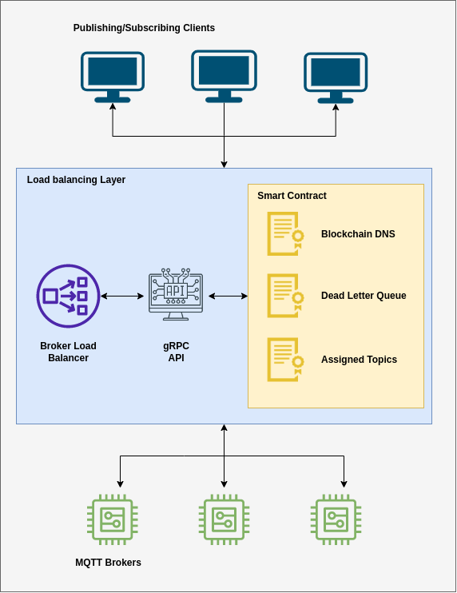

<p align="center">
Bachelor of Technology - Graduation Project
<br>
Batch Number: <b>NWC138</b>
<br>
Authors: <b>(1) Gita Alekhya Paul - RA1911030010014 (2) Yashvardhan Jagnani - RA1911030010035</b>
</p>

# **Abstract**

The MQTT protocol has become increasingly popular in IoT and Edge Computing, as it offers a lightweight and efficient way of exchanging data between publishers and subscribers. While the protocol has implemented fault tolerance through QoS levels 1 and 2, its current limitations have become a significant problem for various use cases. The current specification of MQTT does not provide fault tolerance on the broker end, which can lead to network disruption in case of broker failure. Furthermore, the MQTT protocol does not mention a scalable way of storing unacknowledged messages in QoS levels more than 0. It depends on the memory storage of the broker to store them, which can easily get overwhelmed when brokers handle a vast volume of data.

This paper proposes using Blockchain technology to improve fault tolerance in the dead letter exchanges in QoS levels 1 and 2. By using the Blockchain, the paper suggests that unacknowledged messages can be stored in blocks, allowing for more efficient and secure data management.

Additionally, the paper explores using dynamic load-balancing through Blockchain Naming Services to tackle broker failure in the MQTT protocol. This approach will allow brokers to be hosted under decentralized domain names on the Blockchain, monitored by a load balancer. On brokers failing, the load balancer can migrate topics from the failed broker to the next available broker.

Overall, this research aims to improve the performance and reliability of the MQTT protocol while maintaining its lightweight and minimal overhead nature. By exploring the use of Blockchain technology, the paper offers new insights into how the limitations of MQTT can be addressed and a more reliable and efficient protocol can be developed.

<br>

**Keywords:** Blockchain, Blockchain DNS, Fault Tolerance, MQTT, ZNS

# **Architecture**

<div align="center">

</div>

The proposed architecture has four main components:

1. **Blockchain Smart Contract Layer**
   - Dead Letter Queues for unacknowledged messages with QoS > 0.
   - Blockchain DNS that stores the IP and port for the respective broker for tackling its failure and topic migration.
2. **Distributed Broker Layer**
   - Custom broker implementation that acts as a load balancer for all the brokers.
3. **Load Balancing Layer**
   - gRPC API for blockchain and broker communication.
4. **Client Application Layer**
   - User facing devices, the publisher and the subscribers.

<br>
<br>

---

<br>

<div align="center">

</div>

User flow for the implementation of Dead Letter Exchanges. The flow depicts:

1. Publisher publishing a packet.
2. The packet is received by the Broker and forwarded to the Client (subscriber).
3. In case of a failure, the packet is stored on the blockchain for the Client.
4. On reconnection of the Client, fetching the packets for the respective client.
5. Broker forwarding the fetched packets back to the Client.

<br>
<br>

---

<br>

<div align="center">

</div>

User flow for the implementation of Topic Reassignment on Broker Failure. The flow depicts:

1. Multiple Brokers connecting to the load balancer and their registration to the Blockchain DNS.
2. On disconnection of one Broker, the topics are reassigned to another Broker.

# **Packet Flows**

## Getting Dead Letter Queues for a Client on connection

<div align="center">

</div>
<br>

## Setting Dead Letter Queues for a Client on disconnection

<div align="center">

</div>
<br>

## Broker Registration and Client Connection on initialization

<div align="center">

</div>
<br>

## Client Registration and Topic Migration when Broker disconnects

<div align="center">

</div>

# **Prerequisites**

1. A NodeJS environment
2. Globally (or locally) installed NPM package `yarn`
3. Scilla IDE - Neo Savant
4. MQTTX - for testing

# **Setup**

1. Clone the project, and open it in your editor of choice.
2. Rename and fill the [**`.env`**](./env.example) file accordingly.
3. To start the server and the load-balancer:

```bash
# Install dependencies
yarn

# For production server
yarn start::server
yarn start::load-balancer

# For development server
yarn dev:server
yarn start::load-balancer

```
